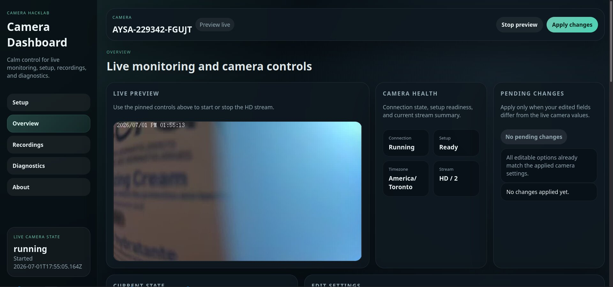
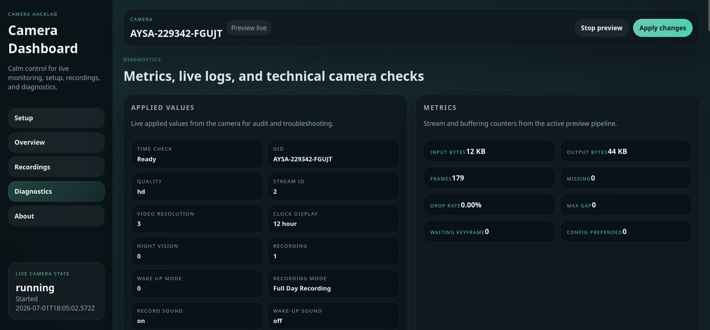
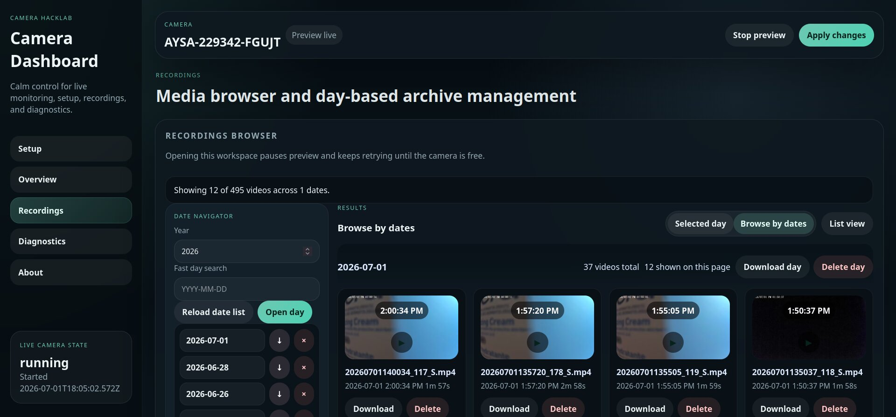
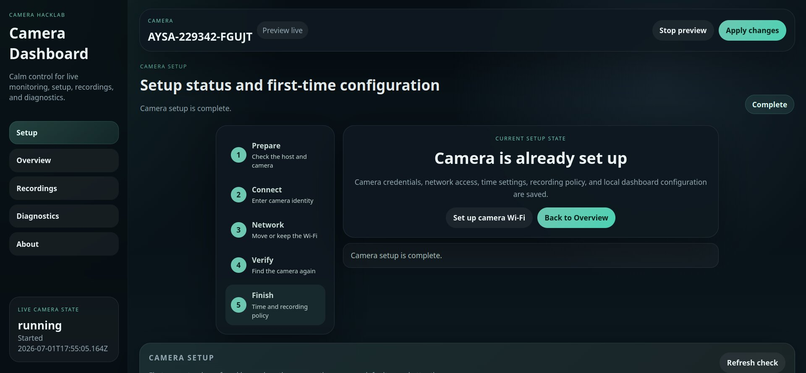
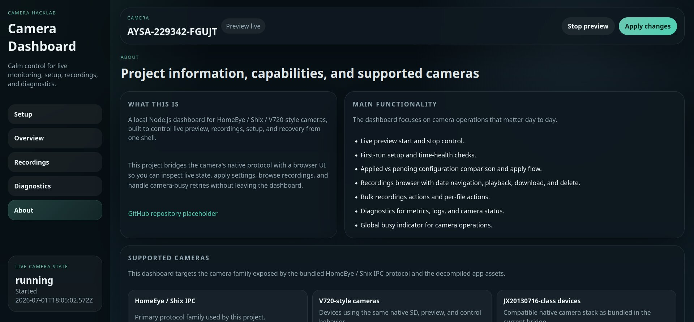

# Camera Hacklab

Camera Hacklab is a local Node.js control panel for inexpensive hidden-camera
alarm clocks and related cameras that use the HomeEye / SHIX IPC protocol. It
was built by studying the original Android application and bridging its native
P2P camera protocol into a browser-friendly dashboard.

The project is intended for cameras you own or are authorized to administer.
It runs locally, talks directly to the camera through the bundled native PPCS
library, and does not require the original mobile application for the features
implemented here.

Our deployment deliberately keeps the camera off the internet. A dedicated
Linux VM provides a private Wi-Fi hotspot for the camera, allows local access
from Camera Hacklab, and blocks internet forwarding because the camera firmware
is not trusted. See [SETUP.md](SETUP.md#isolated-vm-hotspot) for the network
design and local NTP solution. For a plain-language explanation of the complete
current setup, see [HOW_IT_WORKS.md](HOW_IT_WORKS.md).

> **Project status:** reverse-engineering project, not an official HomeEye,
> SHIX, V720, or camera-vendor product. Protocol and firmware differences can
> make nominally similar cameras incompatible.

## Screenshots

These images render in the repository README, which is what GitHub surfaces on
the repo page.

<p align="center">
  
  
</p>

<p align="center">
  
  
</p>

<p align="center">
  
</p>

## Main Features

- Live HEVC camera stream converted to an MJPEG browser preview.
- Start, stop, automatic stale-stream recovery, and preview diagnostics.
- First-run setup checks and camera clock synchronization.
- Dedicated first-time setup workspace for camera identity, Wi-Fi migration,
  reconnection, verification, local NTP, and initial camera policy.
- Automatic detection when Linux is connected to an `AYSA-...` camera hotspot.
- Recording policy configuration, including continuous, alarm, timed, and
  privacy modes.
- SD-card status, recording-date discovery, and per-day recording lists.
- Continuous video pagination across date boundaries, currently 12 videos per
  page.
- Thumbnail generation and caching.
- Per-file, per-day, and all-recordings download and delete actions.
- Original camera file, raw HEVC, and browser-compatible MP4 exports.
- Fast seekable playback cache with compatibility-mode fallback.
- Applied-versus-pending settings display.
- Live logs, stream metrics, camera-operation busy state, and retry handling.
- Low-level Python CLI for protocol research, Wi-Fi provisioning, datetime
  commands, recordings, and direct HEVC capture.

## Supported Cameras

The verified target is the cheap hidden-camera digital clock identified during
development as:

- DID family: `AYSA-*`
- Default login: `admin`
- Default password: `6666`
- Native protocol: HomeEye / SHIX IPC-style PPCS
- Tested quality mapping: `HD` uses stream `2`; `FHD` uses stream `1`

The dashboard may also work with HomeEye, SHIX IPC, V720-style, and
JX20130716-class devices that use the same native command set and recording
format. Those names describe protocol families, not a guarantee that every
camera sold under those brands is compatible.

Compatibility requires the camera to accept the bundled PPCS client library,
the same authentication and control messages, and HEVC video data in the
expected framing. Test with your own device before relying on recording or
delete operations.

## Requirements

### Host

- Linux on `x86_64`
- Node.js 18 or newer
- Python 3.9 or newer
- `ffmpeg` and `ffprobe`
- `zip`
- A browser with JavaScript enabled
- Network access to the camera, either through its setup hotspot, the same LAN,
  or a route usable by its PPCS connection

No npm dependencies are currently required; the server uses Node's built-in
modules.

## What This Folder Includes

The `camera-hacklab` folder includes everything needed for the application
itself:

- Node server and browser dashboard
- Python camera bridge
- Native PPCS and compatibility libraries for Linux `x86_64`
- Camera Wi-Fi migration script
- Setup, architecture, and troubleshooting documentation

It does **not** include a ready-made VM image, Proxmox configuration, hotspot
service configuration, or firewall rules. A new user must either:

- Put the computer and camera on an existing network where the camera can be
  reached, or
- Build an isolated hotspot VM using the design in
  [SETUP.md](SETUP.md#isolated-vm-hotspot).

The folder also cannot supply camera-specific values. The user still needs a
compatible camera, its DID and credentials, and network access to it.

### Restoring excluded vendor files

Public releases should keep the vendor APK and other camera-derived artifacts
out of the Git repository.

To run Camera Hacklab from a fresh public checkout, restore the vendor PPCS
library locally:

1. Download the original Android app package for `HomeEye`
   (`shix.homeeye.camera`).
2. Prefer the official app listing first:
   `https://play.google.com/store/apps/details?id=shix.homeeye.camera`
3. If you cannot obtain the APK through Google Play, use another public APK
   source at your own risk and verify the package name matches
   `shix.homeeye.camera`.
4. From the `camera-hacklab` folder, restore the native library with:

```bash
scripts/install-native.sh /path/to/base.apk
```

You can also point the script at an unpacked directory that already contains
`apk_extract/lib/arm64-v8a/libPPCS_API.so` or `lib/arm64-v8a/libPPCS_API.so`.
The script copies that file into `apk_extract/lib/arm64-v8a/libPPCS_API.so`,
which is where the Node server and Python bridge expect it.

After restoring the file, verify the local runtime:

```bash
npm run check
```

If the native file is in place, the check will report:

```text
OK    file: apk_extract/lib/arm64-v8a/libPPCS_API.so
OK    native PPCS library dependencies
```

Keep these excluded items local:

- `setup/camera.conf`
- `.data/`
- `.cache/`
- any vendor APK or unpacked camera bundle used only to restore native files

Do not commit the restored APK or extracted vendor binaries back into a public
repository unless you have explicit redistribution rights from the vendor.

Install host tools on Debian or Ubuntu:

```bash
sudo apt update
sudo apt install -y nodejs python3 ffmpeg zip
```

Confirm the tools:

```bash
node --version
python3 --version
ffmpeg -version
ffprobe -version
zip -v
```

Or run the included preflight check:

```bash
npm run check
```

This checks the host architecture, required commands, application files,
JavaScript/Python syntax, and native-library dependencies. It does not contact
the camera or validate the hotspot.

### Bundled native files

These files are runtime requirements and must remain in their current relative
locations:

```text
apk_extract/lib/arm64-v8a/libPPCS_API.so
android_compat_libs/libc.so
android_compat_libs/liblog.so
```

Despite the retained APK directory name, the included `.so` files in this
package are `x86_64` Linux binaries. A different CPU architecture needs a
compatible build of the PPCS library and its compatibility libraries.

## Initial Setup

Camera Hacklab now includes first-time setup in the Node dashboard. The shell
automation in [SETUP.md](SETUP.md) remains available for headless recovery and
advanced network troubleshooting.

1. Connect the computer running Camera Hacklab to a network from which the
   camera can be reached. For a new camera, this is usually the camera's own
   hotspot.
2. Find the camera DID, username, and password.
3. Check the local application requirements:

```bash
cd camera-hacklab
npm run check
```

4. Start the dashboard:

```bash
npm start
```

5. Open `http://localhost:8787`.
6. The server opens **First-time Setup** when no completed local configuration
   exists.
7. Follow the five guided stages:
   - Connect Linux to the camera hotspot and let the server find it.
   - Confirm credentials manually only when automatic login is unsuccessful.
   - Choose to keep using the camera hotspot or move to a 2.4 GHz Wi-Fi network.
   - Reconnect Linux and verify camera/SD access.
   - Apply time, video, recording, sound, sleep, and low-power settings.
8. After setup succeeds, the normal Overview, Recordings, Diagnostics, and
   About workspaces are unlocked.

Progress is saved in `.data/setup-state.json`, so restarting the server during
setup returns to the last server-confirmed stage. The completed configuration
is also loaded automatically on later starts.

Use another port if `8787` is occupied:

```bash
PORT=9000 npm start
```

By default the current server code listens on all interfaces, so other devices
on the host network can reach it at `http://HOST_IP:PORT` unless you restrict
it before deployment.

## Hotspot-to-Wi-Fi Migration

Wi-Fi provisioning is currently a Python bridge operation; it is not exposed
as a dashboard form. Run it while the computer can still reach the camera on
the camera's setup hotspot.

The target network can be an isolated VM-hosted hotspot. In our deployment,
that hotspot has no internet forwarding and supplies a local NTP server so the
camera can restore its clock without contacting an external service.

### 1. Stop the dashboard preview

The camera generally handles one control session reliably at a time. Stop the
preview in the UI or stop the Node server before provisioning.

### 2. Scan networks visible to the camera

```bash
LD_LIBRARY_PATH="$PWD/android_compat_libs${LD_LIBRARY_PATH:+:$LD_LIBRARY_PATH}" \
python3 homeeye_live_hevc.py \
  --did "YOUR-CAMERA-DID" \
  --user "admin" \
  --pwd "6666" \
  --scan-wifi \
  --quiet
```

The command prints JSON containing the networks returned by the camera.

### 3. Send the target network

For a typical WPA/WPA2 network:

```bash
LD_LIBRARY_PATH="$PWD/android_compat_libs${LD_LIBRARY_PATH:+:$LD_LIBRARY_PATH}" \
python3 homeeye_live_hevc.py \
  --did "YOUR-CAMERA-DID" \
  --user "admin" \
  --pwd "6666" \
  --set-wifi-ssid "YOUR_WIFI_NAME" \
  --set-wifi-pwd "YOUR_WIFI_PASSWORD" \
  --set-wifi-encryption 3 \
  --quiet
```

`--set-wifi-encryption` is the numeric firmware code sent by the original
protocol. The correct value can vary by firmware; `3` is a common WPA/WPA2
value but should not be assumed for every device. Use the encryption value
reported by the scan response when available.

After `set_wifi`, the camera may disconnect from its hotspot immediately and
take one or more minutes to join the target network. Reconnect the computer to
that network, restart Camera Hacklab, and test the DID connection. If migration
fails, reset the camera to recover its setup hotspot and verify that the SSID,
password, frequency band, and encryption code are supported. Many low-cost
cameras support only 2.4 GHz Wi-Fi.

The provisioning command sends credentials to the camera. It does not modify
the host's NetworkManager, hotspot, router, DHCP, or firewall configuration.

## Dashboard Workspaces

### Overview

- Live preview and connection state.
- Camera setup and time health.
- Current applied configuration.
- Editable settings and pending-change comparison.
- Automatic preview start after a configured camera is discovered.
- One context-aware preview action: Stop while running, Start while stopped.
- Apply action for edited settings.

### Setup

- Always available as a dedicated navigation workspace.
- First reports whether the camera is already configured.
- Runs the complete five-stage onboarding flow when configuration is missing.
- Offers **Set up camera Wi-Fi** later when hotspot mode was initially kept.
- Contains camera time-health refresh and setup editing after onboarding.
- No duplicate Setup action is shown in the top bar or Overview workspace.

### Recordings

- Year and date navigation.
- Selected-day or multi-date browsing.
- Twelve-video pagination across date boundaries.
- Grid/list mode, newest/oldest sorting, time filtering, and thumbnail size.
- Fast playback with a seekable MP4 cache and legacy fallback.
- Individual, whole-day, and all-recordings downloads and deletes.
- Export formats:
  - **Original:** camera-provided recording file.
  - **Raw HEVC:** extracted elementary HEVC stream.
  - **Browser MP4:** HEVC remuxed into a seekable MP4 container.

Camera transfers are intentionally serialized. Concurrent native downloads
were unreliable on the development camera and could produce truncated files.

### Diagnostics

- Input/output byte counts and delivered-frame metrics.
- Estimated missing frames, drop rate, sequence gaps, and keyframe state.
- Live server and camera logs with search and camera-operation filtering.
- SD status and recording-date refresh actions.

## Configurable Options

### Camera identity and preview

| Option | Values/default | Purpose |
| --- | --- | --- |
| `did` | camera DID | P2P camera identifier |
| `user` | `admin` | Camera username |
| `pwd` | `6666` | Camera password |
| `quality` | `hd` / `fhd` | App-style stream selection |
| `stream` | integer, default `2` | Raw stream ID when quality is not used |
| `videoResolution` | `1`, `2`, `3` | Firmware video-resolution setting |
| `previewFps` | default `8` | Browser preview frame rate |
| `previewWidth` | default `960`; `0` keeps source size | Preview output width |
| `previewQuality` | `1`-`31`, default `6` | ffmpeg MJPEG quality; lower is better |

### Recording

| Option | Values/default | Purpose |
| --- | --- | --- |
| `recordVideo` | `0` / `1`, default `1` | Master recording switch |
| `recordMode` | `privacy`, `full_day`, `alarm`, `timed` | Recording policy |
| `recordSound` | `0` / `1`, default `1` | Save audio with recordings |
| `recordSoundDuringWakeUpPeriod` | `0` / `1`, default `0` | Record sound while awake |
| `loopCoverage` | `0` / `1`, default `0` | Overwrite old recordings when storage fills |
| `sdCardRecordingDurationMinutes` | positive minutes, default `10` | Continuous clip length |
| `alarmRecordingDurationSeconds` | positive seconds, default `6` | Alarm clip duration |
| `alarmRecordingIntervalSeconds` | positive seconds, default `30` | Minimum alarm-recording interval |
| `wakeupMode` | `0`, `1`, `2` | Sleep off, timed wake, or alarm wake |
| `timedRecordStart` | `HH:MM`, default `00:00` | Schedule start |
| `timedRecordEnd` | `HH:MM`, default `23:59` | Schedule end |
| `timedRecordDays` | seven-bit mask, default `1111111` | Enabled schedule weekdays |
| `timedRecordEnable` | `0` / `1`, default `1` | Timed schedule switch |

`privacy` disables the normal recording programme, `full_day` records
continuously, `alarm` records around firmware alarm events, and `timed` follows
the configured schedule. Alarm detection itself is firmware-controlled; this
project configures the recording response but does not implement motion
detection in Node.js.

The seven characters in `timedRecordDays` are passed to the camera as its
weekday mask. Keep the dashboard-generated value unless your firmware's day
ordering has been independently verified.

### Device behavior and time

| Option | Values/default | Purpose |
| --- | --- | --- |
| `nightVisionMode` | `0` off, `1` on, `2` auto, `3` auto color | Infrared/color mode |
| `lowPowerMode` | `0` auto, `1` open, `2` close | Firmware low-power mode |
| `timeHour` | firmware integer, default `0` | Original app's `timeHour` field |
| `getDatetime` | boolean | Query datetime when starting preview |
| `syncTimeNow` | boolean | Send the current host time |
| `previewTimeWatch` | boolean | Check and repair time while preview runs |

The first-time wizard defaults to `America/Toronto` and local NTP server
`192.168.50.1`, matching our isolated hotspot. Both are editable before setup
is applied. Setup considers the camera clock healthy when its year, timezone
offset, DST behavior, and clock drift are acceptable.

### Advanced stream and protocol tuning

| Option | Default | Purpose |
| --- | --- | --- |
| `iframeInterval` | `1` second | Recovery keyframe request interval; `0` disables repeats |
| `gapIframeThreshold` | `20` frames | Sequence-gap size that triggers keyframe recovery |
| `setParamDelay` | `1` second | Delay after control parameters |
| `readChunk` | `65536` bytes | Minimum PPCS read buffer |
| `maxReadChunk` | `2097152` bytes | Maximum PPCS read buffer |
| `readTimeout` | `1000` ms | PPCS read timeout |
| `noIframe` | false | Skip the initial keyframe request |
| `noWaitKeyframe` | false | Emit data before a complete keyframe/config set |
| `checkBuffer` | false | Experimentally query PPCS buffered bytes |
| `extraParams` | empty | Additional raw `name=value` firmware parameters |

Advanced settings can make the stream fail or put the camera into an unknown
state. Change one value at a time and keep a record of the known-good values.

## How It Works

```text
Browser dashboard
  |  JSON API + Server-Sent Events + MJPEG
  v
Node server (server.js)
  |  starts and coordinates camera operations
  +--> Python bridge (homeeye_live_hevc.py)
  |      |
  |      +--> bundled PPCS native library
  |              |
  |              +--> camera P2P/control/video channels
  |
  +--> ffmpeg / ffprobe
  |      +--> live HEVC to MJPEG
  |      +--> recording HEVC to MP4 or JPEG thumbnail
  |
  +--> .data setup/config state
  +--> .cache thumbnails and seekable recordings
```

1. The browser loads static HTML, CSS, and JavaScript from Node.
2. `/api/state` provides the current state; `/events` pushes live state and log
   updates using Server-Sent Events.
3. Starting preview launches the Python bridge. The bridge loads
   `libPPCS_API.so`, authenticates using DID/user/password, requests camera
   frames, and writes HEVC to stdout.
4. Node pipes HEVC into ffmpeg, which produces multipart MJPEG for
   `/stream.mjpg`.
5. Control operations stop or pause conflicting camera work, execute serialized
   Python commands, retry camera-busy responses where supported, refresh live
   state, and restore preview when appropriate.
6. Recording discovery queries years, dates, and filenames through native
   commands. The browser paginates a flattened recording sequence while
   preserving date groups.
7. Playback starts a native download and ffmpeg remux job. Completed seekable
   MP4s are range-served from cache. Legacy playback remains available when
   conversion fails.

## Data, Cache, and Persistence

- `.data/setup-state.json` stores the last successfully applied DID and selected
  camera settings.
- `.cache/recording-thumbs/` stores generated JPEG thumbnails.
- `.cache/recording-videos/` stores prepared seekable MP4 recordings.
- Server logs and metrics are held in memory and reset on restart.
- Bulk-download staging uses the operating system temporary directory and is
  deleted after the response finishes.

Delete `.data/setup-state.json` to reset local setup persistence. Delete
`.cache/` to reclaim generated media; it will be recreated as needed. Neither
directory should be committed to Git.

## HTTP API

The browser uses these local endpoints:

| Method and path | Purpose |
| --- | --- |
| `GET /api/state` | Current preview, setup, config, metrics, and logs |
| `GET /events` | Live state/log event stream |
| `GET /stream.mjpg` | Live MJPEG preview |
| `POST /api/start` | Start/restart preview with config |
| `POST /api/stop` | Stop preview |
| `POST /api/restart` | Restart preview |
| `POST /api/apply` | Apply and persist camera settings |
| `POST /api/config/live` | Read settings back from the camera |
| `POST /api/setup/apply` | Apply first-run setup |
| `POST /api/setup/refresh` | Refresh camera setup/time health |
| `GET /api/sd/status` | Query SD-card state |
| `POST /api/sd/days` | List recording dates for a year |
| `POST /api/sd/files` | List files for one date |
| `GET /api/recordings/thumb` | Generate or serve a recording thumbnail |
| `GET /api/recordings/play` | Prepare/serve seekable playback |
| `GET /api/recordings/play-status` | Read playback preparation state |
| `GET /api/recordings/play-legacy` | Compatibility playback stream |
| `GET /api/recordings/download` | Download one original recording |
| `POST /api/recordings/download-bulk` | Download a ZIP selection |
| `POST /api/recordings/delete` | Delete a file, date, or all recordings |

This is an internal control API, not a hardened public API. Request and response
formats can change as camera behavior is reverse engineered.

## Direct Python Bridge

The Python program can be used independently of Node:

```bash
export LD_LIBRARY_PATH="$PWD/android_compat_libs${LD_LIBRARY_PATH:+:$LD_LIBRARY_PATH}"
python3 homeeye_live_hevc.py --help
```

Capture 30 seconds of FHD HEVC:

```bash
python3 homeeye_live_hevc.py \
  --did "YOUR-CAMERA-DID" --user "admin" --pwd "6666" \
  --quality fhd --seconds 30 --out capture.hevc
```

Query camera datetime:

```bash
python3 homeeye_live_hevc.py \
  --did "YOUR-CAMERA-DID" --user "admin" --pwd "6666" \
  --get-datetime --datetime-only --quiet
```

Query a year's recording dates:

```bash
python3 homeeye_live_hevc.py \
  --did "YOUR-CAMERA-DID" --user "admin" --pwd "6666" \
  --sd-record-day 2026 --quiet
```

Query one day:

```bash
python3 homeeye_live_hevc.py \
  --did "YOUR-CAMERA-DID" --user "admin" --pwd "6666" \
  --sd-record-list 20260628 --quiet
```

Always use `--help` as the authoritative list of low-level flags. Delete and
Wi-Fi commands change camera state and should be tested carefully.

## Customization

Common project-level changes:

- Change defaults in `helpers/server/config.js`.
- Change the installation timezone in `helpers/server/setupStatus.js`.
- Change the default listening port with `PORT`.
- Change the recordings page size in `public/app.js` by locating
  `dayPageSize`.
- Change labels, supported-camera text, and the GitHub placeholder in
  `public/index.html`.
- Change visual tokens, responsive layout, and component styles in
  `public/styles.css`.
- Add firmware parameters through **Extra parameters** without changing the
  Python parser.
- Extend camera commands in `homeeye_live_hevc.py`, then expose them through
  `server.js` only after validating request and reply behavior.

When adding camera operations, route them through the existing exclusive/busy
flow. These cameras frequently reject or truncate overlapping operations.

## Security

- The server has no login, authorization, TLS, or CSRF protection.
- It listens on every network interface by default.
- The state API exposes the active configuration, including camera
  credentials.
- Control and delete endpoints can alter the camera.
- Recording downloads may contain private video and audio.

Run Camera Hacklab only on a trusted local network. Use a host firewall or
change the listen address in `server.js` before deploying on a shared network.
Do not expose port `8787` directly to the internet.

## Troubleshooting

### `PPCS_Connect` fails

- Verify DID, username, and password.
- Confirm the camera is powered and reachable.
- Stop other apps or previews using the camera.
- Confirm `LD_LIBRARY_PATH` includes `android_compat_libs`.
- Check **Diagnostics** for the native return code.

### Preview starts but shows no image

- Switch between HD and FHD.
- Restore the default keyframe and buffer settings.
- Confirm ffmpeg is installed.
- Check the ffmpeg and Python logs in **Diagnostics**.

### Camera stays busy

- Stop live preview before recordings or provisioning work.
- Wait for the current native download/conversion to finish.
- Avoid concurrent browser tabs controlling the same camera.
- Restart the Node process if an interrupted operation left stale local state.

### Playback takes time before it becomes seekable

The first playback must transfer the whole camera recording and remux it. The
top-right operation indicator remains active while the camera is working.
Later playback uses `.cache/recording-videos/` and should open faster.

### Recordings or dates look wrong

- Verify the camera clock and timezone through **Setup**.
- Reload the year/date list.
- Check that the SD card is mounted and recognized.
- Treat malformed dates from the camera as firmware/protocol data, not valid
  recordings.

## Project Layout

```text
camera-hacklab/
├── server.js                    Node server and operation coordinator
├── homeeye_live_hevc.py         Native camera protocol bridge and CLI
├── package.json                 Start script and Node package metadata
├── public/                      Dashboard HTML, JavaScript, and CSS
├── scripts/                     Local prerequisite checks
├── helpers/client/              Browser rendering/state helpers
├── helpers/server/              Config, setup, time, and command builders
├── apk_extract/lib/arm64-v8a/   Bundled PPCS library
├── android_compat_libs/         Native compatibility libraries
├── .data/                       Generated persisted settings, ignored
└── .cache/                      Generated media cache, ignored
```

## Work Completed

- Recovered live HEVC frames through the camera's native PPCS interface.
- Mapped HD/FHD streams and keyframe recovery behavior.
- Reconstructed datetime, setup, recording-policy, SD-card, playback,
  download, delete, and Wi-Fi control messages.
- Built a dependency-free Node server around the Python/native bridge.
- Added browser preview conversion, stream health metrics, and automatic stale
  preview recovery.
- Added camera state readback and applied-versus-pending configuration.
- Added complete recording modes and schedule fields found in the original app.
- Added recording date discovery, cross-date video pagination, thumbnails,
  playback, format conversion, bulk transfers, and deletion.
- Added serialized camera operations, busy retry behavior, and one global
  operation indicator.
- Reorganized the UI into Overview, Recordings, Diagnostics, and About
  workspaces.

## Repository

Project repository:

```text
https://github.com/anishacharyaca/camera-hacklab
```

## License

This project is released under the MIT License. Review redistribution rights
for vendor APKs, extracted native libraries, and any other third-party camera
artifacts separately; the MIT license only covers this project's original
source code and documentation.
